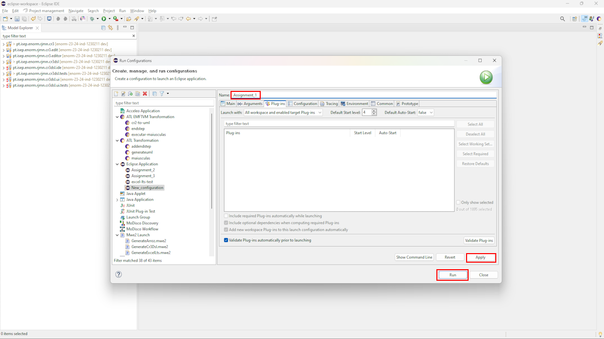
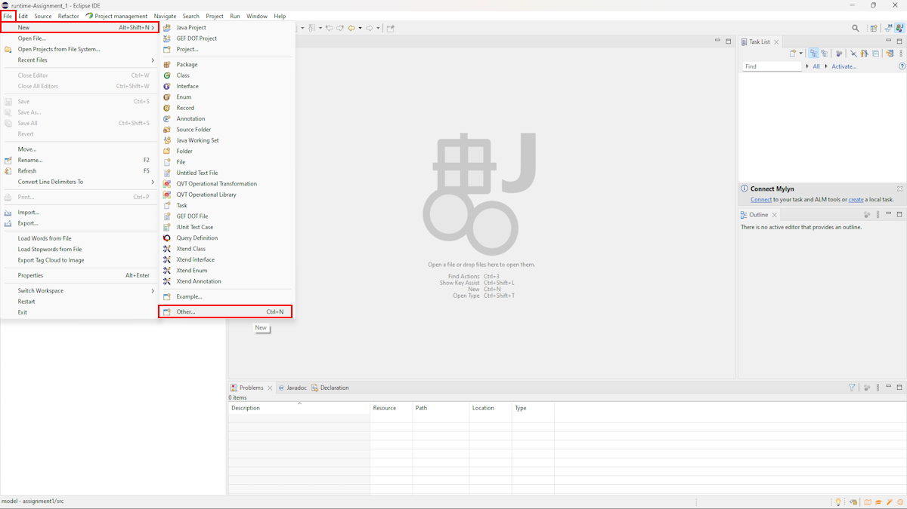
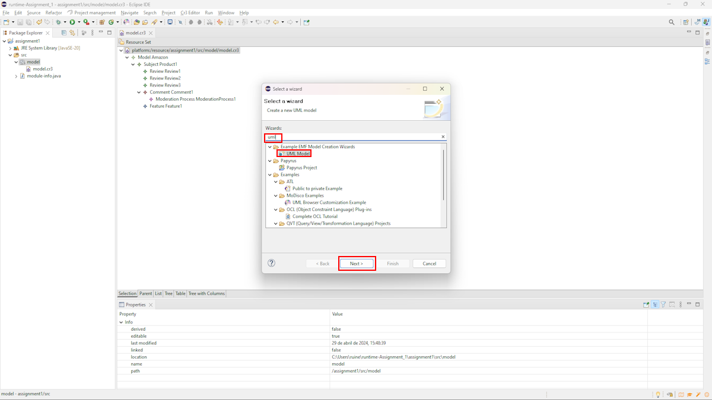
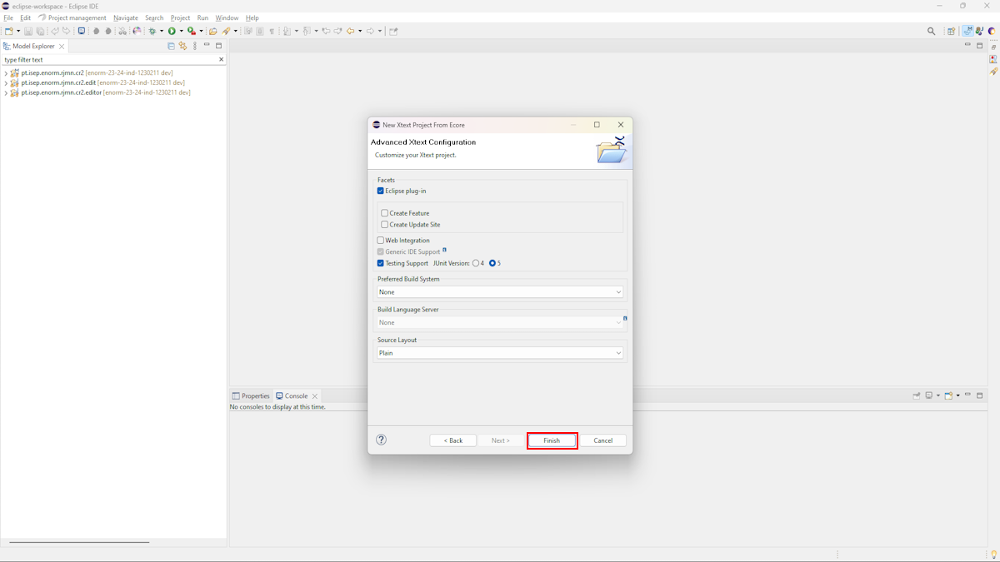
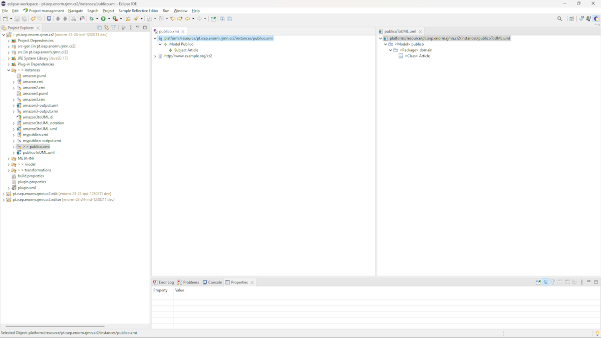
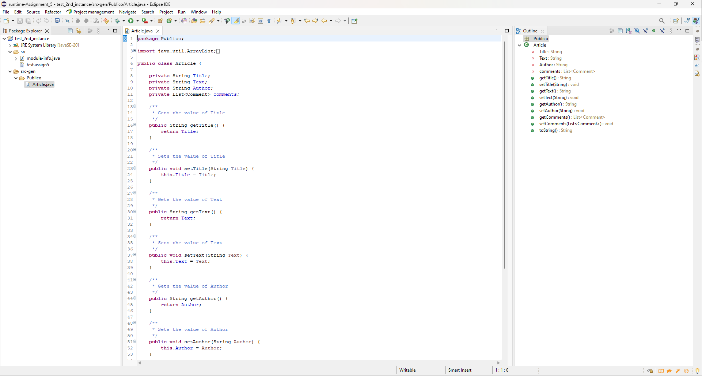

# Repository for Project 3 (Individual)

The goal of this repository is to serve as a template for Part 3 of the project developed during the EDOM course of the MEI Master Program, edition 2022/23.

**Please follow the instructions of the teachers of your course because they will always prevail over what is stated in this readme file.**

## Folders for Each Tool

The projects for each tool should be inside a specific folder (i.e., folders **eclipse** and **tool**). Inside these folders you should create subfolders for each assignment (eg., Modeling, Model Constraints)

**Note:** If for some reason you need to bypass these guidelines please ask for directions with your teacher and **always** state the exceptions in your commits and issues in bitbucket.

## Documentation

It is mandatory to produce documentation for all your Assignments. The documentation **must** always be produced in readme.md files! **You may use this readme file**

These readme.md files use markdown. You may find further documentation about markdown in [Markdown](https://en.wikipedia.org/wiki/Markdown)

### Producing Technical Diagrams

This repository supports the generation of PlantUML diagrams using Gradle.

The PlantUML diagram files must be included in the **diagrams** folder. The file build.gradle and the folder buildSrc is where the gradle support for PlantUML is located.

To generate diagram simple execute "./gradlew" (or "gradlew.bat" in Windows) in a terminal (having the root of the project as the current folder).

The repository includes an example of a PlantUML diagram in diagrams/usecase.puml.


## Issues and Commits

Each student will have a fork of this repository in bitbucket.

It is a good practice to create an **Issue** in bitbucket for each task that you individually will be developing.

Each commit in your repository should always make a reference to the corresponding issue.

You should also close the issue when the task is finished.

For each deadline/submission of your task/project you should also create a tag in the repository.

---

## Report

### Index 

- [How to install Eclipse (Windows):](#how-to-install-eclipse-windows)
- [Questions](#questions)
	- [Assignment 1](#assignment-1)
	- [Assignment 2](#assignment-2)
	- [Assignment 3](#assignment-3)
	- [Assignment 4](#assignment-4)
	- [Assignment 5](#assignment-5)
- [Demonstration Case](#demonstration-case)
	- [Modeling](#modeling)
		- [EMF](#emf)
	- [Model Constraints](#model-constraints)
		- [EMF](#emf-1)
		- [Xtext](#xtext)
	- [Model to Model Transformations](#model-to-model-transformations)
		- [EMF](#emf-2)
		- [Xtext](#xtext-1)
	- [Domain-Specific languages](#domain-specific-languages)
		- [EMF](#emf-3)
		- [Xtext](#xtext-2)
	- [Model to Text Transformations](#model-to-text-transformations)
		- [EMF](#emf-4)
		- [Xtext](#xtext-3)
- [Industry Cases](#industry-cases)
	- [Case 1 - A DSL for Clinical Trial Design](#case-1---a-dsl-for-clinical-trial-design)
		- [Summary of the video](#summary-of-the-video)
		- [Course Topics](#course-topics)
	- [Case 2 - ArchE - An Architecture Modeling Framework for Automotive Domain](#case-2---arche---an-architecture-modeling-framework-for-automotive-domain)
		- [Summary of the video](#summary-of-the-video-1)
		- [Course Topics](#course-topics-1)
	- [Case 3 - DSLs and Code Generation](#case-3---dsls-and-code-generation)
		- [Summary of the video](#summary-of-the-video-2)
		- [Course Topics](#course-topics-2)
- [References](#references)

---

### How to install Eclipse (Windows):

**Eclipse** is an integrated development environment (IDE) used in computer programming. It contains a base workspace and an extensible plug-in system for customizing the environment. It is the second-most-popular IDE for Java development, and, until 2016, was the most popular.

**Step 1: Download Eclipse**

1. Go to the official Eclipse installation site (https://www.eclipse.org/downloads/packages/installer).
2. Click on the version of Eclipse we want to download. The latest version available and suitable for our operating system is recommended.
3. Click on "Download".
4. Wait for the download to complete.

**Step 2: Run Eclipse**

1. Go to the folder where the '.exe' file was saved and click on it.
2. Answer the installation questions that appear.
3. Select the packages to install (Modeling).
4. Choose the installation folder.
5. Launch.

**Step 3: Configure the Workspace**

When we start Eclipse for the first time, it asks to choose a folder for the Workspace. The Workspace is where projects are stored.

1. Select or create a new Workspace folder and click "Ok".

---

### Questions 

#### Assignment 1

**1. How do the modeling concepts of Xtext compare to EMF and Ecore? What are the options available for creating metamodels?**

- **EMF** utilizes Ecore for modeling concepts. Ecore provides a meta-metamodel for describing other metamodels. Ecore is basically a language for defining metamodels, which are essentially blueprints for our data structures. [1]
- While **Xtext** doesn't directly create metamodels, it heavily relies on Ecore. [2] We define our grammar using Xtext's own language, which is then translated into an Ecore metamodel behind the scenes. [3]
    - **There are two ways to work with Xtext**: we can create a metamodel and then create our DSL based on that metamodel; or we can create a DSL and the Xtext generates the metamodel automatically. 

**2. How does code generation for the model compares between EMF and Xtext? If the tool does not generate code explain how it works.**

- **EMF** ships with a code generator that generates Java classes from our Ecore model. The code generators input is called *EMF generator model*. It decorates (references) the Ecore model and adds additional information for the Ecore -> Java transformation. Xtext will automatically generate a generator model with reasonable defaults for all generated meta-models, and run the EMF code generator on them. [4]
- In **Xtext** we are provided with a callback stub that implements IGenerator2 by extending the AbstractGenerator base class. It has three methods that are called from the builder infrastructure whenever a DSL file has changed or should be translated otherwise. [5]

**3. What APIs are available to manage models in Xtext? How they compare to EMF?**

- **EMF** provides a comprehensive set of APIs for manipulating models, including loading, saving, creating, modifying, and querying model elements. These APIs are based on the Ecore meta-metamodel and provide fine-grained control over the model elements. [6]
- **Xtext** also leverages EMF APIs for model management. When working with Xtext-generated DSLs, we interact with EMF APIs (e.g., EObject, Resource). [7]

**4. How models are persisted in Xtext? How does it compare to EMF?**

- **EMF** supports various persistence options including XML, XMI (XML Metadata Interchange), and custom serialization formats. Models can be saved and loaded using these formats, and EMF provides facilities for handling cross-references and resource management. [6]
- **Xtext** inherits the persistence mechanisms provided by EMF. We can use the same formats (like XMI) to store our models defined with Xtext. Additionally, Xtext itself uses its own grammar-specific format for storing the textual representation of the model.

#### Assignment 2

**1. How does the constraints support of Xtext compares to EMF and Ecore?**

- **Ecore** allows the specification of structural constraints using, for example, Object Constraint Language (OCL) invariants. [8] OCL is a declarative language specifically designed for expressing constraints on UML models and their metamodels. [9]
- Constraints in **Xtext** can be specified directly within the grammar definition using validation rules (inside `Validator` in the package `validation`). These constraints are then automatically enforced during the parsing and validation phases. [10]

**2. Xtext supports a language similar to OCL (a DSL for constraints)? Or are constraints specified in code (in a GPL)?**

**Xtext** constraints can be written using OCL if the metamodel is pre-defined using EMF; or as code snippets written in a General Purpose Language (GPL) such as Java or Xtend (using validation rules) if we want validations directly in the Xtext project. [11]

**3. What APIs are available to validate "programmatically" models in Xtext? How do they compare to EMF?**

- Xtext provides the following APIs for programmatically validating models: [11]
  - Lexer/Parser: Syntactical Validation
  - Linker: Cross-reference Validation
  - Serializer: Concrete Syntax Validation

**4. Does Xtext have support to interactively execute queries on models (instances)? How does it compare to the query expressions of OCL?**

After a long search, **it is not obvious** that Xtext supports a language like OCL itself. But this language can be used by Xtext to query data.

#### Assignment 3

**1. How does the model transformation support of Xtext compares to ATL?**

**ATL**, the Atlas Transformation Language, is the ATLAS INRIA & LINA research group's answer to the OMG MOF/ QVT RFP. It is a model transformation language specified as both a metamodel and a textual concrete syntax. In the field of Model-Driven Engineering (MDE), ATL provides developers with a means to specify the way to produce a number of target models from a set of source models. The ATL language is a hybrid of declarative and imperative programming. The preferred style of transformation writing is the declarative one: it enables to simply express mappings between the source and target model elements. However, ATL also provides imperative constructs in order to ease the specification of mappings that can hardly be expressed declaratively. [12]

In Xtext, we can generate a model and then import it to an EMF project and use the ATL to manipulate and create transformations. 

As a second option, we can use the Xtext **Quick Fixes**. For this approach, we just need to create methods inside `quickfixes` dir and add the  `@QuickFix` annotation. Xtext will treat these methods as transformations when an associated constraint violation is verified.

**2. Xtext supports a language similar to ATL (a DSL for model transformations)? Or transformations are specified in code (in a GPL)?**

We can use ATL to manipulate models created with Xtext. In the other hand, Xtext provides a way to transform models using a GPL (like Java, for example). [13] This can be reached with the previous talked quick fixes.

**3. Are transformations rules in the transformation language declarative (as ATL) or imperative?**

Once the Xtext can use ATL, the transformations rules in the transformation language can be declarative. But once quick fixes are also an alternative and are written in an imperative way, we can say that transformation rules **can follow both paths**.

#### Assignment 4

**1.How does the concrete syntax offered by this Picto example compares to that of Xtext**

The concrete syntax of the Picto plugin **shares some similarities with the default grammar generated by Xtext** when a new project is created. Both employ structured, bracketed syntaxes that utilize various bracket types to delineate different elements within the language. For example, Picto often uses square brackets to encapsulate attributes and define properties within its visual modeling language. This is akin to how Xtext’s grammar utilizes brackets to specify rule boundaries and parameterization in language definitions.

However, it's important to note that while the use of brackets is common in many domain-specific languages to organize and clarify the syntax, the specific purposes and semantics of these brackets can vary significantly between different DSLs. In the case of Picto, the brackets primarily serve to visually map model properties to graphical attributes. In contrast, Xtext uses them to structurally define the grammar and parsing rules of the language being developed. Thus, while there is a superficial similarity in syntax structure, the underlying purposes and contexts in which these brackets are used **differ markedly between the two tools**.

**2. Classify both produced DSLs, justifying. Use the same classification categories as presented in lecture 4.**

- Picto:
  - **FOCUS Horizontal**: Picto is not confined to a specific industry or field. While it is used within the context of software modeling, its primary function—to visualize model states—can be applicable in various domains where model visualization is necessary. It addresses general visualization needs across different industries, thus classifying it as a horizontal DSL.
  - **STYLE Declarative**: The nature of Picto DSL, where the user specifies "what" the visual output should look like without needing to describe "how" to create it step by step, classifies it as a declarative DSL. Users define the desired visualizations through rules and properties that describe the result, rather than the sequence of operations to achieve it.
  - **NOTATION Textual**: Although Picto is used to generate graphical outputs, the specifications themselves are written in a textual format, typically using XML or a similar markup language. The DSL involves writing code in a structured text format to define visual models.
  - **INTERNALITY External:** Picto DSL has its own distinct syntax and parsing mechanism, making it an external DSL. It does not rely on embedding its syntax within another host language but stands as its own language with specific parsing rules.
  - **EXECUTABILITY Code Generation**: The primary function of Picto DSL is to generate graphical representations from model specifications. This process involves transforming these specifications into visual outputs, typically through model-to-text transformations or directly into graphical formats. This aligns with code generation, where the DSL definitions are transformed into another form that can be directly utilized (in this case, visual representations).

- Xtext:
  - **FOCUS Horizontal**: Xtext is used to create DSLs and programming languages applicable in various industries. It is not limited to a specific field but rather provides a foundation for building tools and languages that can be specialized for different domains. Therefore, it is classified as a horizontal DSL.
  - **STYLE Declarative**: Although languages developed using Xtext can be either declarative or imperative, the framework itself emphasizes describing what the grammar of the language looks like rather than how to parse it explicitly. We define the grammar in a high-level, declarative manner, and Xtext handles the generation of the parser and infrastructure. This makes Xtext a tool that primarily facilitates the creation of declarative DSLs.
  - **NOTATION Textual**: Xtext is specifically designed for the creation of textual languages. It involves writing grammars in a concise, textual format which then automatically generates code for handling the language parsing. The languages developed using Xtext and their development process are predominantly textual.
  - **INTERNALITY External**: Languages created with Xtext have their own syntax and dedicated parsers, making them external DSLs. Xtext provides a complete infrastructure to define and handle these languages independently of any host language.
  - **EXECUTABILITY Code Generation**: One of the primary features of Xtext is its ability to generate various artifacts based on the grammar provided. This includes generating Java code for parsers, editors, and other components necessary to support the DSL. Thus, Xtext strongly focuses on code generation as a means to produce executable components from language specifications.


**3. Explore how you use your tool to develop the concrete syntax for structural elements and behavioral elements. How different is the syntax for structural and behavior parts of the DSL?**

The structural and behavioral components of the DSL defined in Xtext are quite similar, leveraging a consistent syntax to facilitate developer understanding. However, I have emphasized clarity in describing actions. For instance, in the `Moderation Process`, I require the user to specify transitions explicitly using phrases like "If approved, jump to:" or "If rejected, jump to:" **which clearly delineates behavioral sequences**. This approach not only ensures that users clearly understand the workflow but also prevents any oversight of critical actions."

#### Assignment 5

**1. How does the code generation features offered by Eclipse Epsilon compares to that of Xtext?**

- Eclipse Epsilon is a suite of tools and languages for model-driven development, including code generation. It is language-agnostic in terms of the models it can process, supporting a variety of model types through Eclipse Modeling Framework (EMF). Epsilon provides several specific languages under its umbrella for different aspects of model management. For code generation, Epsilon uses `Epsilon Generation Language` (EGL), a template-based language designed for generating code or other textual artifacts from models.

- Xtext includes a powerful parser generator that creates parsers from grammars we define. Xtext automatically generates an Eclipse-based editor for the DSL and integrates with the EMF. For code generation, Xtext typically employs `Xtend`, a flexible and expressive programming language that is ideal **for template-based code generation**. Xtend allows developers to intermix executable code with static template parts, which can be particularly powerful for generating code based on the structure defined by a DSL.

**2. It is based on templates or it offers other approaches? If based on templates, explain how its features compare to Eclipse Epsilon. If not based on templates, explain the mechanism used to generate text.**

Eclipse Epsilon: The Epsilon Generation Language (EGL) is template-driven. It uses a mixture of static text (the template part) and dynamic sections (where Epsilon's EOL language expressions are embedded) **to control the generation of output based on the input model**. EGL templates look similar to other template technologies like JSP or ASP, where we write the desired output format and embed expressions and logic directly within the template. **While also using a template-based approach**, Xtend enhances the model by integrating seamlessly with Java and providing additional **syntactic sugar**, which is particularly useful in code generation contexts. Xtend supports template expressions using a special syntax `« »` that allows embedding executable expressions directly within the static text. This makes the code generation concise and expressive.

**3. How can you manage the possible customization of generated code so that it is not lost when the generation process is executed again? Does the tool provides any special support for this (e.g. protected regions) or do you have to use patterns, like in this example?**

EGL has mechanisms directly within its template language to safeguard custom code sections against overwriting during regeneration. This can be achieved using `out.startPreserve()` and `out.stopPreserve()`.

Xtend uses a source generating compiler thus the produced Java code for Xtend itself cannot be altered on the source level.Nevertheless, if we use Xtend's template expression to generate code, we can of course insert protected regions. This [OS project](https://github.com/danieldietrich/xtext-protected-regions) on Github implements support for protected regions in Xtend.

---

### Demonstration Case

#### Modeling

##### EMF

> 1 - Create an Ecore Modeling Project by using its wizard.

To create an Ecore Modeling Project, we just need to click on `File` in eclipse, then click on `New` and finally click on `Ecore Modeling Project`.   


> 2 - Edit the ecore model (we should use the term metamodel instead of model because it is a "model of models").
> - Use the tree editor (i.e., "Sample Ecore Model Editor");
> - Use the diagram view editor;
> - Use the text editor (i.e., OCLinEcore).

To use the tree editor for the metamodel creation, we just need to navigate to the `model` dir, then click on the `.ecore` file -> `Open With` and finally select `Sample Ecore Model Editor`.  


The result is represented below.


After created, it is possible to see the metamodel as a diagram with the diagram editor. To do this, we navigate to the `model` dir, then click on the `.aird` file -> `Design` -> `Entities in a class diagram` -> `class diagram` .


The result is represented below.


Finally, to see the metamodel in a text editor, we navigate to the `model` dir, then click on the `.ecore` file -> `Open With` -> `OCLintEcore Editor`.


The result is represented below.


> 3 - Major concepts of Ecore:
> - EClass (attributes and operations);
> - Relations (SuperType, EReference [reference and composition]);
> - Enumeration.

The metamodel defines the types of the semantic nodes as Ecore EClasses. **EClasses** are shown as boxes in the metamodel diagram. An EClass can inherit from other EClasses. Multiple inheritance is allowed in Ecore, but of course cycles are forbidden.

EClasses can have EAttributes for their simple properties. These are shown inside the EClasses nodes. The domain of values for an EAttribute is defined by its EDataType. Ecore ships with some predefined EDataTypes, which essentially refer to Java primitive types and other immutable classes like String and **Enumeration**. To make a distinction from the Java types, the EDataTypes are prefixed with an `E`.

In contrast to EAttributes, **EReferences** point to other EClasses. The containment flag indicates whether an EReference is a containment reference or a cross-reference. In the diagram, references are edges and containment references are marked with a diamond. At the model level, each element can have at most one container. On the other hand, cross-references refer to elements that can be contained anywhere else.

> 4 - Use the genmodel to generate code to support a modeling "environment" that conforms to the metamodel. 
> - New Plugin Eclipse Projects are generated.
> - Run a new instance of Eclipse with the new modeling "environment" activated. Create model (i.e., instances).

To generate the code to support the modeling environment, we navigate to the `model` dir, right clicked on the `.genmodel` file -> `Open With` -> `EMF Generator`. The steps are shown below.


After this, we just need to right click on the model presented in the file and click on `Generate All` as shown below.


The next image shows the result. A `.edit` and `.editor` dirs were created.


Now, to run a new instance of Eclipse with the new modeling "environment" activated, we just need to follow this steps:

Click on the little arrow besides the run button and click on `Run Configurations...`.


Create a new run configuration by clicking on the white file on the top left corner.


After this, we give a name to the configuration, click `Apply` and finally, click on `Run`.



A new instance of eclipse is now created. To test our metamodel, we create a simple Java Application, create a `model` folder, and inside we will add a new `.cr3` file (the name we gave to the extension when creating the ecore modeling project). 

To do this, we go to `File` -> `New` -> `Other`.



Now, we search for our extension (cr3) and select `Next`.


Then, we give a name to the file, we choose the folder to the file to be saved and hit `Next` again.


After that, we choose the Model Object, which is `Model` in our case and hit `Finish`. 


Finally, we have created our model and we can add the children and the siblings of our `Model`. An example is shown below.


> 5 - Create dynamic instances (do not require code generation to work).


To create a dynamic instance, the process is pretty simple. In our first instance of Eclipse, we navigate to the `.ecore` file and open it. Then, we go to the `Model` class, right click on it, and select `Create Dynamic Instance...`.  


Now, we need to choose the name and the folder to save it, and click on `Finish`.


The dynamic instance is created and we can manipulate the tree to create our pretended model. In the example below, the model is saved inside `instances` folder.


> 6 - Use the generated code and the EMF API to manage models.

To use the EMF API and generate a model programmatically, we created a `SaveModel.java` file and added the code inside it.

To run the method created previously, we just need to right click on the file, select `Run As` -> `Java Application`. 


A new model with the extension `.xmi` is created with the name and inside the folder we define here:

```java
public class SaveModel {
  public static void saveModel() {
    ...
    // Obtain a new resource set
    ResourceSet resSet = new ResourceSetImpl();
    // create a resource inside the resource set
    Resource resource = resSet.createResource(URI.createURI("instances/amazon.xmi"));
    ...
  }
}
```


> 7 - Generate graphical model representations with PlantUML.

There are many ways to create a `PUML` file. The first one is made by going to `File` -> `New` -> `Other`.


Then search by "UML", select `UML Model` and hit `Next`.



Then, we give a name to our UML file and hit `Next` again.


Finally, we define the Model Object, and hit `Finish`.  


Another way to do this is creating a new Java file. and program the UML generation. To run the method created, we just need to right click on the file, select `Run As` -> `Java Application`. 


A `.puml` is created inside the defined folder and with the plugin, we can easily see the PUML generated.


#### Model Constraints

To bolster confidence in the model's capacity to generate accurate code, it's essential to undertake thorough and early validation. While crafting the metamodel lays a strong foundation, it may not capture all requisite constraints. Therefore, **complementary semantic validations become imperative to guarantee the integrity of the model**.

Within this section, we will delve into a comprehensive overview of the constraints established to safeguard against erroneous instantiations, thereby fortifying the model's robustness.

##### EMF

In EMF, we can use the Object Constraint Language (OCL) to define our model constraints. **OCL** is a declarative language describing rules applying to metamodels. Initially, OCL was merely a formal specification language extension for UML. OCL may now be used with any Meta-Object Facility (MOF) Object Management Group (OMG) metamodel, including UML. 

The OCL is a precise text language that provides constraint and object query expressions on any MOF model or metamodel that cannot otherwise be expressed by diagrammatic notation.

> 1 - Apply constraints to the EMF metamodel using OCL.

To apply this constraints to our metamodel, we need to navigate to the `.ecore` file, right click it, select `Open With` and finally `OCLintEcore Editor`.

We applied all the following 8 constraints:

**1: Feature - Names must not be empty**

```
invariant mustHaveName: not self.name.oclIsUndefined();
```

**2: Feature - 2 Names must have at least 3 characters**

```
invariant mustBeGreaterThan3Chars: self.name.size() > 3;
```

**3: Feature - Names must start with uppercase**

```
invariant nameMustStartWithUppercase: self.name.substring(1,1).toUpper().compareTo(self.name.substring(1,1))=0;
```


**4: Feature - Names must be unique**

```
invariant nameMustBeUnique: Feature.allInstances()->isUnique(e | e.name);
```

**5: Subject - Can have one or two UserFeedback but of different types**

```
invariant userFeedbackOfDifferentTypes: self.userFeedback->isUnique(oclType().name);
```

**6: Subject - Should have a read-only attribute returning the number of features**

```
attribute featureCount : Integer[1] { derived readonly transient volatile }
{
  initial: self.feature->size();
}
```

**7: Comment - Should have a read-only derived boolean attribute indicating if there is a moderation process**

```
attribute hasModerationProcess : Boolean[1] { derived readonly transient volatile }
{
  initial: not self.moderationProcess->isEmpty();
}
```

**8: ModerationProcess - One (and only one) End step is mandatory**

```
invariant oneEndStepMandatory : self.step->select(e | e.oclIsTypeOf(End))->size()=1;
```

**9: ValidationStep - Reject and Approve cannot move to the same step, except if it is the End step**

```
invariant mustHaveDifferentStepsExceptForEnd: self.nextApprove = self.nextReject implies self.nextApprove.oclIsTypeOf(End);

```

The invariants appear in the metamodel as represented in the image below.


> 2 - Validate created in EMF model using Sample Reflective Editor.

Now, to validate our models against the predefined constraints, we can use the `Validate` option present in the `Sample Reflective Editor`. 


As we can in the following image, the model had errors - **so the validation fails**. Luckily, we have access to what is wrong, which make it easier for us to correct the errors. We just need to click on `Details` when an error occurs.


Now, if we correct the errors, we can see the message saying "Validation completed successfully".


##### Xtext

> 3 - Create an Xtext project.

From now on, the assignments will be made using EMF and the select tool - **Xtext**.
To create an Xtext project based on the metamodel, we just need to click on `File` -> `New` -> `Other`.


Then , we search for Xtext, select the `Xtext Project From Existing Ecore Models` option and click on `Next`.


Here, we need to select de EPackage to generate the Xtext grammar - so we click on `Add...`. 


Select the `.genmodel` from our metamodel (must be present in the workspace) and hit `OK`. 


After the genmodel is selected, we need to specify the Entry rule which, in our case, is `Model - cr2`. Then, we hir `Next`.


Here, we can define the Xtext project name, The language name and the language extension. After all filled, we hit `Next`. 


Check the predefined values, and if we don't want to change anything, we just hit `Finish`.



After the project creation, we need to generate the artifacts to fulfill the folders that does not contain all the necessary code for the plugin to work.

To do this, we access the principal folder and navigate to the .file with the name of our language suffixed by `.xtext`. Here we right click on the file and select `Run As` -> `Generate Xtext Artifacts`.   


As a result, the folders are all fulfilled and a message saying "Done." appears.


> 4 - Apply constraints using Xtext Validation Rules.

Xtext has a its own way of validation. This is called `Validation Rules`. This functionality allows us to write validation using Java. 

To write this validations, we need to navigate to the `.validation` folder and open the `Validator.java` file. Here we just need to define our constraints methods and put the `@Check` annotation so the compiler assumes the methods as validations.

An example of validations is presented below.   

```java
public class MyDslValidator extends AbstractMyDslValidator {

	@Check
	public void checkModelStartsWithCapital(Model model) {
		if (!Character.isUpperCase(model.getName().charAt(0))) {
			warning("Model name should start with a capital", getCurrentObject().eClass().eContainingFeature());
		}
	}
}
```


Finally, to test our DSL, we can create a second Eclipse instance, create a Java project, and add a file with the extension we define previously. If the model doesn't match our grammar or violates any constraint, an error will appear in the top left corner.

The image below shows a valid model that matches all the rules of our metamodel.


> 5 - Use the Xtext Generator to generate and update things automatically at the runtime.

Inside out `.generator` folder, we have a `MyGenerator.xtend` file that contains a `doGenerate` method. This method allows us to create xtend code (which basically a Java variance) to generate assets at the runtime. 

In the example below, we used this powerful possibility to generate the plantUML of our current model.


This is the result at the runtime. The assets are created inside the `src-gen` folder, which is created automatically.


#### Model to Model Transformations

##### EMF

To do our required model to model transformations, we will need to use the ATL Transformation Language (ATL). ATL is a model transformation language and toolkit. In the field of Model-Driven Engineering (MDE), ATL provides ways to produce a set of target models from a set of source models. **Developed on top of the Eclipse platform**, the ATL Integrated Environnement (IDE) provides a number of standard development tools (syntax highlighting, debugger, etc.) that aims to ease development of ATL transformations.

To convert a project to an ATL project, we need to access the main folder, right click on it, then click on `Configure` -> `Convert to ATL Project`. The image below says "Remove ATL Nature" because we already convert it.


Now, we can create a `transformations` folder to save all out ATL files. To create a new one, we right click on the transformations folder, click on `File` -> `New` -> `Other` -> `ATL File`. 


Then we define a name for the module, choose a file type of `Refining module`, and finally choose the Input and Output models. Hit `Finish`.


> 1 - For some constraints (i.e., invariants) it is possible to define transformations to automatically solve the issue identified by the constraint.

To define our rules, we can open the `.atl` file and write it as shown in the image below. We should not forget to add the `emftvm` compiler at the start of the file. In the following example we are changing **all the features names to uppercase**.  


To run the transformation, we just need to navigate to the `Run Configurations` page and create a new `ATL EMFTVM Transformation`, which corresponds to our new compiler.
Here we give it a name, we define the previously done module (.emftvm), the metamodel, and the input and output models.


The result of the transformation is showed below. On the left is the `.xmi` model to be transformed, which has a Feature `price` started by a lowercase; and on the right is the model after transformation, where all the the Features start by uppercase as expected. 


We can also generate a model to model transformation programmatically. An example of adding an `End` step is shown in the image below.


The result is presented as follows. We can see that the model has now an `End` step due to the transformation made.


Code for `uppercase`:

```java
-- @atlcompiler emftvm
-- @path MM=/pt.isep.enorm.rjmn.cr2/model/cr2.ecore

module maiusculas;
create OUT: MM refining IN: MM;

rule FeatureName2UpperCase {
	from
		t1: MM!Feature (
			t1.name.substring(1, 1).toUpper().compareTo(t1.name.substring(1, 1)) <> 0
		)
	to
		t2: MM!Feature (
			name <- t1.name.substring(1, 1).toUpper() + t1.name.substring(2, t1.name.
					size())
		)
	do {
 		-- debug can be used to print to the console
 		('Applied FeatureName2UpperCase for Feature ' + t1.name).debug();
 	}
}
```

Code for `addendstep`:

```java
-- @atlcompiler emftvm
-- @path CR2=/pt.isep.enorm.rjmn.cr2/model/cr2.ecore

module addendstep;
create OUT : CR2 refining IN : CR2;

rule AddEndStep {
	from
		m1: CR2!ModerationProcess (
			not m1.step -> exists(s | s.oclIsTypeOf(CR2!End))
		)
	to
		m2: CR2!ModerationProcess (
			step <- m1.step -> including(newEndStep)
		),
		newEndStep: CR2!End (
			-- nothing to do here, because End has no attributes
		)
	do {
		-- debug can be used to print to the console
		('Applied AddEndStep for ModerationProcess ' + m1.name).debug();
	}
}
```

> 2 - For the CR2 project we will be adding a model to model transformation that will demonstrate how to produce a model of a different metamodel.
> - In this example we will use an implementation of the UML metamodel.
> - The transformation will create a UML model from the CR2 model.
> - In this simple example, we will create a UML model containing a class for the CR2’ Subject.

We can generate a transformation from a model to to an UML model as follows: 

```java
module generateuml;

create OUT: UML from IN: CR2;

rule Model2Model {
	from
		m1: CR2!Model
	to
		m2: UML!Model (name <- m1.name.toLowerCase(), packagedElement <- Set{m2Domain}),
		m2Domain: UML!Package (name <- 'domain', packagedElement <- Set{m1.subject})
	do {
		('Model ' + m1.name + ' created').debug(); 
	}
}

rule Subject2EntityClass {
	from
		a1: CR2!Subject
	to
		a2: UML!Class (name <- a1.name)
	do {
		('Entity Class ' + a1.name + ' created').debug(); 
	}
}
```

**This is the result:**



> 3 - We can use the resulting UML model with other EMF compatible tools.
> - For instance, the Papyrus plugin will enable us to build graphical UML diagrams based on our UML model.

Another thing we can do is make a UML diagram based on the UML file we made before. To achieve this, we can use the Eclipse plugin `Papyrus`.

`Papyrus` is an environment for editing any kind of EMF model, particularly supporting UML 2 (Unified Modeling Language (UML) version 2.4.1) and related modeling languages such as SysML (System Modeling Language) and MARTE (Modeling and Analysis of Real-Time and Embedded systems). Papyrus also offers very advanced support for UML profiles that enables us to define editors for DSLs based on the UML 2 standard. Papyrus **is a collection of plug-ins and features on top of the EMF**. 


##### Xtext

> 4 - Add Quick Fixes to resolve the broken rules discovered by Validation Rules.

Model to model refactoring refer to the automated process of converting a model conforming to one metamodel (source) into a new model compliant. Refactoring act as an adapter, taking the structure and elements from the source model and translating them into a format compatible with the target metamodel. To achieve this in Xtext, we can use `Quick Fixes`.

When we generate the Artifacts, Xtext also generates an `ui` folder that contains all the necessary classes to manipulate the User Interface (UI) of our DSL. Inside this folder, there's another folder that contains a class that extends the `DefaultQuickfixProvider`.

This class **allow us to create the quick fixes** using the `@Fix` annotation.

**For example:**
 
For this `Validation Rule`:

```java
public class Assign3Validator extends AbstractAssign3Validator {
	
	public static final String MODEL_NAME_CAPITAL = "Model name should start with a capital.";
	
	@Check
	public void checkModelStartsWithCapital(Model model) {
		if (!Character.isUpperCase(model.getName().charAt(0))) {
			error(MODEL_NAME_CAPITAL, Cr2Package.Literals.MODEL__NAME, MODEL_NAME_CAPITAL);
		}
	}
}
```

We can define this `Quick Fix`:

```java
public class Assign3QuickfixProvider extends DefaultQuickfixProvider {

	@Fix(Assign3Validator.MODEL_NAME_CAPITAL)
	public void fixModelNameNotStartWithCapital(final Issue issue, IssueResolutionAcceptor acceptor) {
	    acceptor.accept(issue, "Change the model name to start with capital", "", "icon.png", new ISemanticModification() {
	        @Override
	        public void apply(EObject element, IModificationContext context) throws Exception {
	            if (element instanceof Model) {
	                Model model = (Model) element;
	                char firstLetter = Character.toUpperCase(model.getName().charAt(0));
	                String newName = firstLetter + model.getName().substring(1);
	                model.setName(newName);
	            }
	        }   
	    });
	}
}
```

The `@Fix(Assign3Validator.MODEL_NAME_CAPITAL)` annotation gets the issue we defined in the error message when creating the custom validation - only when that rule is broken **the associated quick fix appears**.

**Example**  

As shown below, when the first letter of the `Model` name is not uppercase, a `Quick Fix` appears to save our life. If we click on it, the first letter changes to uppercase. 


The result **is shown below**.


#### Domain-Specific languages

##### EMF

> 1 - For this assignment we will use Eclipse Epsilon.
> - Please install it using: "Help" -> "Marketplace...". Then, in the "Find" field enter "Epsilon" and then click "Install".

`Epsilon` is a family of Java-based scripting languages for automating common model-based software engineering tasks, such as code generation, model-to-model transformation and model validation, that work out of the box with EMF (including **Xtext** and Sirius), UML, XML and other types of models.

To start the assignment, the plugin was installed accessing the `Eclipse Marketplace`. 


> 2 - Use the EGX/EGL Epsilon Languages to design the projections that will be generated for our CR2 models.

`EGX` is a rule-based co-ordination language designed for automating the parametrized execution of model-to-text template transformations. Although built on top of the Epsilon Generation Language (`EGL`), EGX can in principle work with any template-based model-to-text transformation language. The rationale for this co-ordination language comes from the need to invoke text generation templates multiple times with various parameters, **usually derived from input models**.

`EGL` is a model-to-text transformation (M2T) language that can be used to transform models into various types of textual artifacts, including code (e.g. Java), reports (e.g. in HTML/LaTeX), images (e.g. using Graphviz), formal specifications, or even entire applications comprising code in multiple languages (e.g. HTML, Javascript and CSS). EGL **is a template-based language** and provides several features that simplify and support the generation of text from models.

To complete this task, we created a `.egx` file that takes two rules: 
- cr2model2Graphviz
- ModerationProcess2Graphviz

The rule `cr2model2Graphviz` has the `cr2model2graphviz.egl` as template and passes the `m.subject` variable as parameter - which is the subject of the model defined to transform. 

```
rule cr2model2Graphviz 
transform m : cr2::Model {
	template : "cr2model2graphviz.egl"
	parameters : Map {
		"path" = Sequence{"Structure", m.name},
		"icon" = "diagram-ffffff",
		"format" = "plantuml",
		"subject" = m.subject
	}
}
```

The `cr2model2graphviz.egl` is shown below.


The rule `ModerationProcess2Graphviz` has the `moderationProcess2graphviz.egl` as template and passes the `p` variable as parameter - which is the moderation process defined to transform. 

```
rule ModerationProcess2Graphviz 
transform p : cr2::ModerationProcess {
	template : "moderationProcess2graphviz.egl"
	parameters : Map{
		"path" = Sequence{"Moderation Process", p.name},
		"icon" = "diagram-c0c0c0",
		"format" = "graphviz-dot",
		"process" = p
	}
}
```

The `ModerationProcess2Graphviz.egl` is shown below.


> 3 - Create an instance of our metamodel with the Epsilon textual flexmi editor.
> Annotate the flexmi instance to use the specific previous EGX generator the metamodel elements.

To achieve this task, we created a `.flexmi` file and created a valid model using its concrete syntax. It is important to note the second line of the created file. The line `?render-egx: ../picto/cr2model2diagram.egx` was added, so the `epsilon` plugin knows where to get the rules for the transformations. 

**The complete result is shown below**.

Note that the rule that passed the model subject as parameter **just shows** the `Subject` and its `Features`, while the rule that passed the moderation process **just shows** the `Moderation Process`.


##### Xtext

The **grammar language** is the corner stone of Xtext. It is a domain-specific language, carefully designed for the description of textual languages. The main idea is to describe the `concrete syntax` and how it is mapped to an in-memory representation – the semantic model. This model **will be created by the parser on-the-fly** when it consumes an input file.

For this activity, we tried to change the Xtext grammar so it looks more readable and less hard to understand. We changed the brackets to `:`, added more context to the necessary inputs, and changed some value positions so the model looks awesome **for any eyes** - even for those people who are not completely inside the business logic.

This image represents the model that followed the grammar **before the changes**.


The following image shows the model that followed the grammar **after the changes**. The model is more short and compact. As you can see on the right window, the model is exactly the same. The `concrete syntax` is the only thing that changes.  


#### Model to Text Transformations

##### EMF

> 1 - Understand and apply variability at the code level.
> - Understand variability realization techniques (there are severals, but let us focus on the ones we already know from design patterns).
> - Identify commonality and variability in the implemented prototype, and implement variability.

The prototype made uses the `Factory pattern` as a way to support variability **and allow extending the generated code**. The following example shows how we can use this technique to allow the user to manually
customize the behavior associated with the `ModerationProcess`.

To validate the Publico comments, we instantiate a new comment `c` passing the text, author and date of the comment to be validated as parameters. Then, we instantiate a `ValidateCommentProcess` class, that has the `Automatic` and `Manual` validations. Those represents the automatic and manual validations defined on the metamodel.

```java
Comment c = Factory.newComment(text, author, date);
ValidateCommentProcess validate = new ValidateCommentProcess(c);
```
The `Factory Pattern` can be used to introduce variability in the comments validation process. To achieve this, we can define a `SFactory` interface, that has two implementations. Then we just need to define in the code which implementation we want to use. **This is represented below**.

If we want to use the normal factory, we need to call `SFactoryMain.getSFactory()` in the `Main` class, which calls the default implementation.

```java
SFactoryMain.getSFactory();

public ValidationCommentProcess getValidationProcess(Comment c) {
	return new ValidationCommentProcessImpl(c);
}
```

Or we can use the alternative factory. To do so, we set the alternative implementation in the `Main` class.

```java
SFactoryMain.setSFactoryImpl(new SFactoryAlternativeImpl());

public ValidationCommentProcess getValidationProcess(Comment c) {
	return new ValidationCommentProcessImpl2(c);
}
```

> 2 - Understand and apply ways to organize generated code so that it can be extended manually and not lost when regenerating.
> - For instance, by applying the Generation Gap Pattern (John Vlissides).

This task can be completed by generating two folders for different proposes. One is the `src` folder that will have the **Variable** and **Manual** code that the user can manipulate. The other will be the `src-gen` which is a folder that contains the **Common code** and should not be modified. If we want to modify any file inside this folder, we need to change the rules and respective templates, **and re-generate the folder**.


> 3 - We can now move into understanding Epsilon and how it can be used to generate code.
> We will use EGL/EGX (Epsilon Generation Language).

What allows us to generate the code, are the generation templates `EGX` and `EGL`. In the EGX files, we define `rules` and inside the rules we define the `object` that we want to transform. Then, we pass all the parameters that we will want to use in the template. After that, we must define the `.egl` template to be used by that rule (using `template` key), and finally we can define a path for the file to be saved at (using `target` key). For example:

```java
pre {
	var theModel = Model.all.first();
}

rule Subject2Class 
transform subject : Subject {
	parameters {
		var params : new Map;
		params.put("theModel", theModel);
		params.put("isComment", Comment.all.size>0);
		return params;
	}
	template : "subject2class.egl"
	target : "../src-gen/pt/isep/enorm/rjmn/"+ theModel.name + "/domain/" + subject.name + ".java"
}
```

In the `EGL` files, we can right plain text mixed with logic. To do this, we can use the following notation: `[% logic here %]`. I we want to write a variable, use the `=` as this: `[%= myVariable %]`.


To preserve tha manual code in the generation we can use `protected regions`. They follow the above notation:

```java
[%= out.startPreserve("user code", true) %]
// begin user code
// end user code
[%= out.stopPreserve() %]	
```

> 4 - Run configuration to generate the code.

To generate the code, we need to create a new `EGL Generator` Run Configuration, give it a name and access the `Models` tab to choose the model.


Then, we click on `Edit...`.


And finally we choose the model that we want, in our case, the `publico.xmi` present in the models folder.


##### Xtext

> 1 - Writing a Code Generator With Xtend.
> - This prototype will be made following the example presented in: 
> 	- https://eclipse.dev/Xtext/documentation/103_domainmodelnextsteps.html#tutorial-code-generation
> - With the help of:
> 	- https://eclipse.dev/Xtext/xtend/documentation/203_xtend_expressions.html#templates.

As soon as we generate the Xtext artifacts from the grammar, a code generator stub is put **into the runtime project of our language**. Let’s see how we integrated our own code generator with `Xtend`.

First of all, we need to locate the file `Assign5Generator.xtend` in the package `org.example.mydsl.generator`. This Xtend class is used to generate code for our models in the standalone scenario and in the interactive Eclipse environment.

Then we will have to filter the contents of the resource down to the defined entities. Therefore **we need to iterate a resource with all its deeply nested elements**. This can be achieved with the method `getAllContents()` of our `Subject` object. To use the resulting `TreeIterator` in a for loop, we use the extension method `toIterable()` from the built-in library class `IteratorExtensions`.

```java
class Assign5Generator extends AbstractGenerator {
	override void doGenerate(Resource resource, IFileSystemAccess2 fsa, IGeneratorContext context) {
		for (s : resource.allContents.toIterable.filter(Subject)) {}	
    }
}
```

After that, to determine the file name of the Java class that each entity should yield, we will use the qualified name of the entity **since Java enforces this pattern**. The qualified name itself has to be obtained from a special service that is available for each language. Fortunately, **Xtend allows to reuse that one easily**. We simply inject the `IQualifiedNameProvider` as a field into the generator.

```java
@Inject extension IQualifiedNameProvider
```

This allows to ask for the name of an entity. It is straightforward to convert the name into a file name:

```java
class Assign5Generator extends AbstractGenerator {
  	@Inject extension IQualifiedNameProvider
	override void doGenerate(Resource resource, IFileSystemAccess2 fsa, IGeneratorContext context) {
		for (s : resource.allContents.toIterable.filter(Subject)) {
	        fsa.generateFile(
            	s.fullyQualifiedName.toString("/") + ".java",
            	s.compile)
    	}	
    }
}
```

The next step is to write the actual template code for an our `Subject` entity. For now, the function s.compile does not exist, **but it is easy to create it**:


Then, when we init a second Eclipse instance, we can create a simple Java project and create a file with or model, **as represented below**:


Finally, a `src-gen` file is created with our `doGenerate` code. The result is shown below. On the right of the screen, we can see all the methods and attributes created. This is super interesting.



---

### Industry Cases

#### Case 1 - A DSL for Clinical Trial Design

##### Summary of the video

The [DSL for Clinical Trial Design video](https://youtu.be/1yIDSrFP2qQ?si=cdSdkd6EsRpjEFDS) talks about CLARIO, an organization specialized in crafting tailored solutions for gathering clinical trial data, encompassing hardware, software, and online platforms. As the landscape of clinical trials evolves with the inclusion of more specific medications and an expanding array of sensors, trial protocols become increasingly intricate. However, **CLARIO sees this complexity as an opportunity** and is dedicated to simplifying it by introducing a suite of DSLs to comprehensively outline protocol logic.

At the heart of every clinical trial lies the protocol, a vital tool for evaluating the safety and efficacy of new pharmaceuticals or medical equipment on a global scale. Given the potential impact on countless lives, robust evidence is non-negotiable. Demonstrating the safety and efficacy of a new medical intervention necessitates reliable data.

The accompanying video provides insight into how DSLs function by modeling protocols. By enabling domain experts to articulate intricate protocol requirements without drowning in technical jargon, DSLs empower efficient protocol execution while facilitating early detection of configuration or logic issues.

In essence, a protocol acts as a guide, directing participants through various decisions and actions from initiation to completion. DSLs streamline the process of defining these forms, ensuring accuracy and user-friendliness while integrating essential medical insights to effectively identify pertinent outcomes. The resultant decentralized data can be consolidated into various document formats such as Word or HTML, facilitating analysis by stakeholders such as physicians and researchers.

A pivotal feature of DSLs is their seamless integration with devices capable of autonomously providing data without explicit input from participants. This integration simplifies the incorporation of diverse sensors found in devices like smartwatches (providing vital information) and mattresses (monitoring sleep quality), which often adhere to disparate protocols. DSLs effectively manage the intricacies associated with integrating with these varied platforms.

##### Course Topics

**Model-Driven Engineering**

***Principles***

**For instance, how they address "models+transformations=software"?**

They embody this principle by facilitating software development through direct modeling of desired protocols within the DSL environment. While specific details about multiple transformations are not explicitly outlined, it's reasonable to infer the existence of a model-to-text transformation, which generates the code or software for the clinical trial protocol.

***Use Cases***

**For instance, it is a forward engineering case or a reverse engineering case?**

The scenario primarily represents a forward engineering case. It's about moving from an abstract depiction to a tangible one, rather than the reverse.

***Model-Driven Architecture (MDA) and UML***

- **e.g., Are MDA or any of its principles followed?**
- **e.g., How does the case relates to UML?**

In this instance, the principles of MDA are evident, with models derived from the DSLs serving as platform-independent models (PIM) transformed into platform-specific models (PSM) through model transformations. UML is not directly employed in the modeling process but there's potential to introduce an additional layer by initially defining the model with UML and subsequently transforming it into the DSL language.

***Integrating MDSE in the Development Process***

- **e.g., How does the case relate to Domain-Driven Design?**
- **e.g., How does the case relates to Tests oriented approaches (e.g., Test-DrivenDevelopment)?**
- **e.g., How does the case relates do Agile approaches?**

The case of this video aligns well with DDD principles by emphasizing understanding the problem domain over getting bogged down in technical details. The use of a DSL to develop software, ensuring model correctness without technical constraints, inherently embodies DDD principles. 

TDD is also integral, facilitating protocol definition and testing within a unified framework. 

Agile principles are exemplified through the efficient transition from executable models to working software.

***Domain-Specific Languages***

- **e.g., Are there DSLs in the case? How can we characterize the DSLs?**

The case employs DSLs, primarily textual, complemented by UI elements for model definition.

***Tools used***

- **e.g., What MDE tools are used in the case? How they relate to the ones in the ENORM course?**

The primary MDE tool utilized is MPS. This aligns with tools used in the MDE domain talked in the ENORM course.

**Software Product Lines**

- **e.g, Is there a Domain Engineering process in the case?**
- **e.g., Is there an Application Engineering process in the case?**
- **e.g., Is there Product Line Management process in the case? How to management and technical aspects integrate?**
- **e.g., Are there Variability Models involved in the case?**

In this scenario, we observe the synergy between Domain Engineering and Application Engineering, highlighted by the iterative use of DSLs in crafting novel platforms for clinical trial data collection. 

The implementation of product line management further emphasizes this dynamic, signifying the presence of a suite of software-intensive systems sharing a standardized feature set, such as the clinical trial software in focus. Instead of starting from scratch with each clinical trial software iteration, the adoption of DSLs streamlines the process and promotes behavior reuse, shifting the workload from application engineering to domain engineering. 

Given the unique specifications accompanying each clinical trial protocol, DSLs effectively handle variability, allowing for the derivation of individual systems with variations on a common theme.

#### Case 2 - ArchE - An Architecture Modeling Framework for Automotive Domain

##### Summary of the video

The [ArchE video](https://www.youtube.com/watch?v=xc1CMM0LztQ) talks about a DSL crafted by CARIAD, a Volkswagen Group subsidiary, which stands as an internal architectural modeling framework finely tuned for the automotive sector. The intricacies of developing sophisticated vehicle functionalities necessitate the integration of architectural views across system and software layers at various levels of abstraction. Traditional development environments often consist of disjointed tools housing redundant information, fostering silos and opacity within architecture, with maintaining consistency across views requiring laborious manual effort.

This case underscores the mounting challenges in the automotive realm as it pivots towards a software-centric paradigm, demanding adaptability and agility to navigate rapid advancements. In this landscape, versatile tooling capable of catering to diverse user backgrounds is indispensable.

ArchE emerged as a DSL tailored for systems engineering, meticulously designed to encapsulate CARIAD's unique requirements in architecting vehicle functionalities. Its inception stemmed from the fragmentation of tasks and resources across disparate external tools catering to hardware, software, and architecture domains. Catering to a vast user base comprising hundreds of domain experts, ArchE accommodates professionals ranging from architects to safety and software engineers, showcasing its versatility and broad utility across distinct expertise domains.

##### Course Topics

**Model-Driven Engineering**

***Principles***

**For instance, how they address "models+transformations=software"?**

ArchE stands out in its focus on facilitating architecture within the organization, rather than targeting a specific product line. The video doesn't explicitly delve into whether the created models are transformed into code or software, but it hints at heavy utilization of generators.

***Use Cases***

**For instance, it is a forward engineering case or a reverse engineering case?**

ArchE is positioned as a forward engineering case, concentrating on the development of new solutions without extracting knowledge from lower abstraction representations.

***Model-Driven Architecture (MDA) and UML***

- **e.g., Are MDA or any of its principles followed?**
- **e.g., How does the case relates to UML?**

ArchE doesn't strictly adhere to MDA principles, but it shares similarities, especially regarding the creation of platform-independent models (PIM) and their transformation into platform-specific models (PSM). 

SysML, a profile of UML tailored for systems engineering, is mentioned. SysML serves similar purposes to UML in specialized domains.

***Integrating MDSE in the Development Process***

- **e.g., How does the case relate to Domain-Driven Design?**
- **e.g., How does the case relates to Tests oriented approaches (e.g., Test-DrivenDevelopment)?**
- **e.g., How does the case relates do Agile approaches?**

ArchE's construction aligns with DDD principles, emphasizing the creation of a tool finely tuned to the automotive industry's domain. 

While TDD isn't explicitly mentioned, and the Agile development approach fosters an environment of continuous feedback and rapid iteration.

***Domain-Specific Languages***

- **e.g., Are there DSLs in the case? How can we characterize the DSLs?**

ArchE employs DSLs tailored to the domain of architecture engineering within the automotive industry. These DSLs facilitate modeling through various methods.

***Tools used***

- **e.g., What MDE tools are used in the case? How they relate to the ones in the ENORM course?**

The primary MDE tool utilized is MPS. This aligns with tools used in the MDE domain talked in the ENORM course.

**Software Product Lines**

- **e.g, Is there a Domain Engineering process in the case?**
- **e.g., Is there an Application Engineering process in the case?**
- **e.g., Is there Product Line Management process in the case? How to management and technical aspects integrate?**
- **e.g., Are there Variability Models involved in the case?**

In this scenario, Domain Engineering emerges as a pivotal force, evident in the recurrent utilization of the ArchE tool by domain experts. 

Details about artifacts derived from model representations are lacked, but the reference to model transformations hints at the generation of software from architectural models. 

Thus, it's reasonable to deduce the presence of an Application Engineering (AE) process wherein software artifacts are synthesized based on architectural models fashioned using the ArchE tool.

Though not explicitly mentioned, the perspective of viewing each car function as a product resonates with Product Line Management (PLM) principles.

Moreover, considering the intricate nature of car architectures and the imperative for variability management, the involvement of Variability Models (VMs) seems probable. 

#### Case 3 - DSLs and Code Generation

##### Summary of the video

The [DSLs and Code Generation video](https://youtu.be/1yIDSrFP2qQ?si=cdSdkd6EsRpjEFDS) provided a comprehensive exploration of Domain-Specific Languages (DSLs) and code generation, focusing on their practical applications and benefits. Scott Stanchfield, the video creator, began by discussing the challenges of using JSON and XML for data entry, highlighting the common user's preference for more user-friendly formats like Excel.

Moving on, Stanchfield delved into the advantages of DSLs, emphasizing their ability to simplify data entry, reduce code verbosity, and align with specific tasks and user expertise. He explored examples of both Internal and External DSLs, illustrating how they can enhance readability and efficiency in software development.

A highlight of the session was the presentation of a **Text Adventure game example**, showcasing the evolution from verbose definitions to more fluent APIs and ultimately to DSLs using Xtext. These demonstrations underscored the importance of tailoring language constructs to match the problem domain, especially when dealing with complex dependencies like cyclic relationships.

Moreover, Stanchfield examined an Object Model Generation project, which automate code generation to ensure consistency and save development time. Practical insights were provided on leveraging Eclipse's incremental compilation feature and strategies for customizing code generation, emphasizing clarity and maintainability.

In conclusion, the video emphasized the versatility of code generation tools across various programming languages and the importance of judiciously applying them to address specific development challenges. By leveraging DSLs and code generation effectively, developers can streamline workflows, improve code quality, and empower non-programmers to contribute meaningfully to software projects.

##### Course Topics

**Model-Driven Engineering**

***Principles***

**For instance, how they address "models+transformations=software"?**

The case addresses the principle of "models+transformations=software" by demonstrating how DSLs (Domain-Specific Languages) are utilized to define models, which are then transformed into executable software. For example, in the Text Adventure game example, DSLs are used to define the game's structure and logic, which are then transformed into runnable code.

***Use Cases***

**For instance, it is a forward engineering case or a reverse engineering case?**

The case primarily exemplifies forward engineering, where DSLs are used to define models that are subsequently transformed into software artifacts. Reverse engineering is not explicitly addressed in the case.

***Model-Driven Architecture (MDA) and UML***

- **e.g., Are MDA or any of its principles followed?**
- **e.g., How does the case relates to UML?**

MDA principles are partially followed, particularly in the emphasis on using models to drive software development. However, the case does not explicitly mention adherence to the full MDA framework. As for UML, it is not prominently featured in the case; instead, DSLs are utilized for modeling purposes.

***Integrating MDSE in the Development Process***

- **e.g., How does the case relate to Domain-Driven Design?**
- **e.g., How does the case relates to Tests oriented approaches (e.g., Test-DrivenDevelopment)?**
- **e.g., How does the case relates do Agile approaches?**

The case relates to Domain-Driven Design (DDD) by demonstrating how DSLs can be tailored to specific problem domains, enhancing clarity and alignment with domain concepts. While not explicitly mentioned, the case showcases a test-oriented approach to development, especially evident in the iterative refinement of the Text Adventure game example. Additionally, the agile development approach is indirectly supported through the iterative nature of DSL refinement and code generation.

***Domain-Specific Languages***

- **e.g., Are there DSLs in the case? How can we characterize the DSLs?**

DSLs are prominently featured in the case, particularly through the use of Xtext to define languages specific to the problem domains of the Text Adventure game and Object Model Generation projects. These DSLs are characterized by their ability to capture domain-specific concepts and facilitate more natural expression of domain logic.

***Tools used***

- **e.g., What MDE tools are used in the case? How they relate to the ones in the ENORM course?**

The main MDE (Model-Driven Engineering) tool used in the case is Xtext, which enables the creation of DSLs and their integration into the software development process. This tool relates to those covered in an MDE course by providing similar capabilities for language definition and code generation.

**Software Product Lines**

- **e.g, Is there a Domain Engineering process in the case?**
- **e.g., Is there an Application Engineering process in the case?**
- **e.g., Is there Product Line Management process in the case? How to management and technical aspects integrate?**
- **e.g., Are there Variability Models involved in the case?**

While the case does not explicitly mention a Domain Engineering process, elements of it can be inferred through the creation of DSLs tailored to specific problem domains. The Application Engineering process is evident in the generation of executable software artifacts from domain-specific models. Product Line Management aspects are not explicitly addressed, but the use of DSLs allows for the management of variability through the definition of configurable features within the models. Variability Models are indirectly involved through the customization options provided by DSLs, allowing for the definition of variant product configurations.

### References 

(1) [https://developer.vonage.com/en/blog/boost-your-productivity-with-model-driven-engineering-part-1](https://developer.vonage.com/en/blog/boost-your-productivity-with-model-driven-engineering-part-1)

(2) [https://eclipse.dev/Xtext/documentation/308_emf_integration.html#:~:text=It%20decorates%20(references)%20the%20Ecore,EMF%20code%20generator%20on%20them.](https://eclipse.dev/Xtext/documentation/308_emf_integration.html#:~:text=It%20decorates%20(references)%20the%20Ecore,EMF%20code%20generator%20on%20them.)

(3) [https://eclipse.dev/Xtext/documentation/301_grammarlanguage.html](https://eclipse.dev/Xtext/documentation/301_grammarlanguage.html)

(4) [https://eclipse.dev/Xtext/documentation/308_emf_integration.html#emf-codegen](https://eclipse.dev/Xtext/documentation/308_emf_integration.html#emf-codegen)

(5) [https://eclipse.dev/Xtext/documentation/303_runtime_concepts.html#code-generation](https://eclipse.dev/Xtext/documentation/303_runtime_concepts.html#code-generation)

(6) [https://www.ibm.com/docs/en/developer-for-zos/15.0?topic=guides-emf-framework-programmers-guide](https://www.ibm.com/docs/en/developer-for-zos/15.0?topic=guides-emf-framework-programmers-guide)

(7) [https://eclipse.dev/Xtext/documentation/308_emf_integration.html#:~:text=Xtext%20relies%20heavily%20on%20EMF,in%20the%20context%20of%20Xtext.](https://eclipse.dev/Xtext/documentation/308_emf_integration.html#:~:text=Xtext%20relies%20heavily%20on%20EMF,in%20the%20context%20of%20Xtext.)

(8) [https://projects.eclipse.org/projects/modeling.mdt.ocl](https://projects.eclipse.org/projects/modeling.mdt.ocl)

(9) [https://dl.gi.de/server/api/core/bitstreams/00f744d4-ab68-437b-9f5f-6550729d1e0c/content](https://dl.gi.de/server/api/core/bitstreams/00f744d4-ab68-437b-9f5f-6550729d1e0c/content)

(10) [https://eclipse.dev/Xtext/documentation/103_domainmodelnextsteps.html#:~:text=with%20an%20underscore.-,Creating%20Custom%20Validation%20Rules,this%20kind%20of%20validation%20rules.](https://eclipse.dev/Xtext/documentation/103_domainmodelnextsteps.html#:~:text=with%20an%20underscore.-,Creating%20Custom%20Validation%20Rules,this%20kind%20of%20validation%20rules.)

(11) [https://eclipse.dev/Xtext/documentation/303_runtime_concepts.html](https://eclipse.dev/Xtext/documentation/303_runtime_concepts.html)

(12) [https://help.eclipse.org/latest/index.jsp?topic=%2Forg.eclipse.m2m.atl.doc%2Fguide%2Fuser%2FOverview-of-the-Atlas-Transformation-Language.html](https://help.eclipse.org/latest/index.jsp?topic=%2Forg.eclipse.m2m.atl.doc%2Fguide%2Fuser%2FOverview-of-the-Atlas-Transformation-Language.html)

(13) [https://www.eclipse.org/forums/index.php/t/159523/](https://www.eclipse.org/forums/index.php/t/159523/)